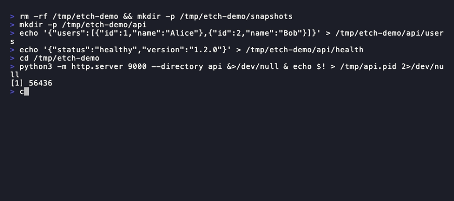

# etch

**Detect API changes instantly - and verify API consistency - without writing a single test.**



Etch tells you what changed in your API and whether it's safe. It runs as a local proxy, records real responses, and catches every field-level change automatically.

```bash
etch record          # capture baseline
etch test            # detect changes
etch test --spec api.yaml  # detect + validate against contract
etch approve         # accept intentional changes
```

No SDK. No test code. No LLM or API key needed. Works with any language, fully offline.

## What it looks like

```
Test Summary (mode: smart):
  Total:      3
  Matches:    1
  Mismatches: 2
  Breakdown:  1 critical, 1 warning

  ✗ GET http://api.example.com/users
    ✗ status_code: 200 → 500  [HTTP status code changed]
    ! body.users[0].role: "admin" → "viewer"  [value changed]
    ~ headers.Date: <http-date> → <http-date>  [dynamic field (likely noise)]

Schema Validation:
  ✗ body.email: field missing from response
  ! body.metadata: field not defined in spec (undocumented)
  Schema: 1 error(s), 1 warning(s)

✗ Unsafe changes detected
  2 mismatch(es)
  1 schema violation(s)
```

## Install

```bash
# one-liner (requires Go 1.22+)
go install github.com/ojuschugh1/etch/cmd/etch@latest
```

Or build from source:

```bash
git clone https://github.com/ojuschugh1/etch.git
cd etch
make build
```

Or grab a pre-built binary from [Releases](https://github.com/ojuschugh1/etch/releases).

## Quick start

```bash
# 1. record - capture API responses as baseline
etch record --port 8080
# (in another terminal) run your app with http_proxy=http://localhost:8080
# ctrl+c when done

# 2. auto-suppress noisy fields (timestamps, IDs, trace headers)
etch noise --write

# 3. test - detect what changed
etch test --port 8080
# (run the same requests again)
# ctrl+c - see summary

# 4. validate - check against your API spec (optional)
etch test --spec openapi.yaml

# 5. approve - accept intentional changes
etch approve
```

## Why etch?

| Traditional approach | Etch |
|---------------------|------|
| Write test code for every endpoint | Just run your app |
| Maintain mocks and fixtures | Real responses, recorded automatically |
| Language-specific test frameworks | Works with any language |
| Tests pass but behavior changes silently | Catches every field-level change |
| Manual schema validation | Validates against OpenAPI automatically |
| Compares specs/docs (can be outdated) | Compares actual runtime responses |

### Etch vs existing tools

| | Postman | Pact | Keploy | Etch |
|---|---|---|---|---|
| Requires writing tests | Yes | Yes | No | No |
| Language-specific | No | Yes | Yes (SDK) | No |
| Zero config to start | No | No | No (eBPF/SDK) | Yes |
| Catches silent behavior changes | No | Partial | Yes | Yes |
| Schema validation | No | Partial | No | Yes |
| Works with any HTTP client | No | No | No | Yes |
| Requires kernel module or SDK | No | No | Yes | No |

### How does etch compare to Keploy?

Keploy records API calls and database queries using eBPF kernel hooks or language-specific SDKs. It's powerful but requires infrastructure changes. Etch takes a different approach: zero dependencies, no kernel module, no SDK - just set `http_proxy` and go. Etch tests API behavior, not database state. For environment-level isolation, use it alongside your existing test data setup.

### What etch is (and isn't)

Etch catches regression - unintended changes in API responses. It's not a correctness testing tool. For verifying business logic, combine etch with your existing unit tests. They're complementary, not competing.

Etch is built for testing APIs you depend on but don't own - third-party services, internal microservices, partner APIs. For APIs you own and control, tools like Keploy (which records database state alongside API responses) may be a better fit. Etch's proxy architecture means it works with zero setup on any API, but it doesn't manage backend state. Use `before_test` hooks in `.etch/config.json` to reset your database before each test run if needed.

Etch's approach is backed by recent research: Monce et al. (2025) proposed API Interaction Snapshots for detecting behavioral breaking changes that only surface at runtime - essentially the same problem etch solves for HTTP APIs. The noise detection and normalization system aligns with work on API invariant mining (MINES, 2025), which separates signal from noise in runtime API behavior.

## How it works

```
┌─────────────┐     ┌───────────┐     ┌──────────────┐
│  Your App   │────▶│   Etch    │────▶│  Upstream    │
│             │◀────│  (proxy)  │◀────│  API Server  │
└─────────────┘     └───────────┘     └──────────────┘
                         │
                    ┌────┴────┐
                    │  .snap  │
                    │  files  │
                    └─────────┘
```

1. **Record** - proxy captures real API responses as JSON snapshots
2. **Test** - replay traffic, compare field-by-field, classify severity
3. **Validate** - check responses against your OpenAPI spec
4. **Approve** - accept intentional changes as the new baseline

Snapshots are deterministic JSON with sorted keys - they diff cleanly in PRs.

## Real-world example: monitoring a third-party API

Say your app depends on Stripe, GitHub, or some internal service you don't control. The spec might say `user_id` is an integer, but one day the API starts returning it as a string `"4521"` without updating the docs. Your code breaks, your tests pass, and nobody knows why.

Here's how etch catches that:

```bash
# 1. record a baseline during development
http_proxy=http://localhost:8080 etch record
# run your app's payment flow, user flow, etc through the proxy
# ctrl+c when done

# 2. auto-ignore noisy fields (timestamps, request IDs, trace headers)
etch noise --write

# 3. in CI, test against baseline using schema mode
#    (only flags type/structure changes, ignores value changes)
etch test --mode schema --ci
# exit 0 = types and structure unchanged, safe to deploy
# exit 1 = something structural changed, investigate before deploying

# 4. when something changes, see what happened
etch diff
etch history --endpoint "GET /users"

# 5. if the change is intentional, approve it
etch approve
```

The key difference from swagger/OpenAPI diffing: etch works off real traffic, not documentation. Specs can be outdated, incomplete, or just wrong. Etch catches what the API *actually returns*, not what the docs say it should return.

## Commands

### Core workflow

```bash
etch record                    # capture baseline snapshots
etch test                      # detect changes (exit code 1 if mismatches)
etch test --spec api.yaml      # detect changes + validate against spec
etch diff                      # show pending changes
etch approve                   # accept all pending changes
etch approve --request <hash>  # accept one specific change
etch approve --pattern <field> # accept all changes matching a field name
etch approve --dry-run         # preview what would be approved
```

### Analysis

```bash
etch validate --spec api.yaml  # validate snapshots against OpenAPI spec
etch verify                    # run metamorphic relation checks
etch coverage                  # show which endpoints have snapshots
etch learn                     # show learned field constraints
etch noise                     # detect noisy fields, suggest .etchignore rules
etch noise --write             # auto-generate .etchignore
```

### Utilities

```bash
etch openapi                   # generate OpenAPI spec from snapshots
etch mock                      # serve snapshots as a mock server
etch report                    # generate HTML diff report
etch watch                     # continuously monitor for changes
etch ca-cert                   # print CA cert path (for HTTPS)
etch version                   # print version
```

### Flags

```
--port       Proxy listen port (default: 8080)
--snap-dir   Snapshot directory (default: .etch/snapshots)
--config     Config file path (default: .etch/config.json)
--ci         CI mode: no color, non-interactive
--mode       Comparison mode: raw, smart (default), strict
--explain    Show why fields were normalized or ignored
--spec       OpenAPI spec for schema validation (on test command)
```

## Test modes

| Mode | Behavior |
|------|----------|
| `raw` | No normalization - compare values exactly as-is |
| `smart` | Normalize UUIDs, timestamps, JWTs, trace IDs (default) |
| `strict` | Only normalize timestamps and trace IDs |

```bash
etch test --mode raw      # catch everything, including noise
etch test --mode smart    # daily usage (default)
etch test --mode strict   # conservative normalization
```

## Noise reduction

Real APIs return timestamps, UUIDs, and trace IDs that change every request. Etch handles this at three levels:

1. **Auto-normalization** - UUIDs become `<uuid>`, timestamps become `<timestamp>`, etc.
2. **`.etchignore`** - manual rules for project-specific noise
3. **`etch noise`** - auto-detects noisy fields with confidence scoring
4. **Array reordering** - `[Alice, Bob]` vs `[Bob, Alice]` is treated as identical (same elements, different order)

```
# .etchignore
headers.Date
headers.X-Request-Id
body.created_at
body.meta.*
```

```bash
etch noise          # see what's noisy and why (with confidence %)
etch noise --write  # auto-generate .etchignore
```

## Severity classification

Every diff is classified automatically:

| Symbol | Severity | Examples |
|--------|----------|---------|
| `✗` (red) | Critical | Status code change, field removed, type change, price change |
| `!` (yellow) | Warning | Value changed, header changed |
| `~` (gray) | Info | Timestamp, trace ID, request ID (likely noise) |

## Schema validation

Validate recorded responses against an OpenAPI spec:

```bash
etch validate --spec openapi.yaml
```

Or combine with testing (recommended):

```bash
etch test --spec openapi.yaml
```

Detects: missing fields, type mismatches, undocumented fields, unknown endpoints.

## Metamorphic relation checks

Define consistency rules in `.etch/relations.json`:

```json
{
  "relations": [
    {
      "name": "user count matches list",
      "type": "consistency",
      "endpoints": ["GET /users", "GET /users/count"],
      "field": "users",
      "count_field": "count"
    },
    {
      "name": "admin users are subset of all users",
      "type": "subset",
      "endpoints": ["GET /users?role=admin", "GET /users"],
      "field": "users"
    }
  ]
}
```

Run them:

```bash
etch verify
# Relation checks: 2 passed, 0 failed
#   ✓ user count matches list - array length matches count (2)
#   ✓ admin users are subset - filtered results are a subset of unfiltered
```

Supported relation types: `equivalence`, `subset`, `consistency`, `idempotent`. This catches correctness bugs that snapshots alone can't - like pagination totals not matching, or filtered results containing items that shouldn't be there.

## LLM diff summaries (100% optional - etch works fine without this)

All of etch's diffing, normalization, schema comparison, and noise detection runs locally with pure Go code. No AI, no external API calls, no API key needed.

If you *want* human-readable summaries of complex diffs, you can optionally plug in an LLM API key. But this is a nice-to-have, not a requirement. Most users will never need it.

Add to `.etch/config.json`:

```json
{
  "llm": {
    "endpoint": "https://api.openai.com/v1/chat/completions",
    "api_key": "sk-...",
    "model": "gpt-4o-mini"
  }
}
```

10-second timeout. Falls back to raw diff on failure. No API calls if key is empty.

## Works with every language

Etch operates at the network level. Any HTTP client works.

<details>
<summary><strong>curl / Python / Node / Go / Java / Ruby / PHP / Rust / C# / Swift / Kotlin / Dart</strong></summary>

```bash
# most languages: just set the env var
http_proxy=http://localhost:8080 ./your-app

# or configure explicitly in your HTTP client
# proxy: http://localhost:8080
```

See [examples/](examples/) for language-specific setup.
</details>

## HTTPS

```bash
etch ca-cert  # print CA cert path
# trust it, then:
https_proxy=http://localhost:8080 curl https://api.example.com/users
```

## Configuration

`.etch/config.json`:

```json
{
  "port": 8080,
  "snap_dir": ".etch/snapshots",
  "excluded_headers": ["Date", "Authorization", "X-Request-Id"],
  "normalizers": [
    {"pattern": "ORD-[0-9]{6}", "replace": "<order-id>"}
  ],
  "env": {
    "BASE_URL": "https://api.staging.example.com"
  },
  "hooks": {
    "before_test": "make db-reset",
    "after_record": "git add .etch/"
  }
}
```

CLI flags always override config. Custom normalizers let you handle project-specific dynamic values. Hooks run shell commands before/after operations - useful for resetting test databases or auto-committing snapshots.

For CI with expiring auth tokens:

```bash
etch test --ci --inject-header "Authorization: Bearer $FRESH_TOKEN"
```

## CI/CD

```bash
etch test --ci --spec openapi.yaml
# exit 0 = clean, exit 1 = changes detected or schema violations
```

GitHub Actions and GitLab CI templates included. See [.github/actions/](.github/actions/) and [.gitlab/](.gitlab/).

## Project structure

```
etch/
├── cmd/etch/            # CLI entry point
├── internal/
│   ├── approval/        # approve/reject workflow
│   ├── ca/              # TLS certificate generation
│   ├── config/          # config + CLI flag merging
│   ├── constraint/      # field constraint learning
│   ├── coverage/        # endpoint coverage reports
│   ├── diff/            # comparison engine + severity
│   ├── hash/            # deterministic request hashing
│   ├── ignore/          # .etchignore parser
│   ├── llm/             # optional LLM diff summaries
│   ├── mock/            # mock server from snapshots
│   ├── noise/           # noise detection + normalization
│   ├── openapi/         # OpenAPI spec generation
│   ├── proxy/           # HTTP/HTTPS reverse proxy
│   ├── schema/          # OpenAPI schema validation
│   └── snapshot/        # snapshot file I/O
├── examples/            # language-specific examples
├── .github/             # CI templates
├── .gitlab/             # CI templates
└── Makefile
```

## Running tests

```bash
make test                # all tests
go test ./... -v         # verbose
go test -race ./...      # race detector
```

## Roadmap

### Shipped

- [x] HTTP/HTTPS proxy with record + test modes
- [x] Field-level JSON diff with severity classification (critical / warning / info)
- [x] Noise reduction (auto-normalization + `.etchignore` + `etch noise` auto-detection)
- [x] Test modes (`raw` / `smart` / `strict`)
- [x] Schema validation against OpenAPI specs (`etch test --spec` / `etch validate`)
- [x] Mock server from recorded snapshots (`etch mock`)
- [x] Endpoint coverage reports (`etch coverage`)
- [x] Constraint learning from recorded traffic (`etch learn`)
- [x] Confidence scoring for noise detection
- [x] Pluggable normalizers via config
- [x] `--explain` flag for normalization transparency
- [x] `--dry-run` for safe approval previews
- [x] Optional LLM diff summaries (BYOK)
- [x] CI/CD templates (GitHub Actions + GitLab CI)
- [x] Cross-platform builds (Linux, macOS, Windows)
- [x] OpenAPI 3.0 spec generation from traffic
- [x] Array reordering treated as non-breaking (order-insensitive comparison)
- [x] Pattern-based bulk approvals (`etch approve --pattern <field>`)
- [x] Metamorphic relation checks (`etch verify`)
- [x] Environment variable support in snapshots (`{{ENV_VAR}}`)
- [x] HTML diff reports (`etch report`)
- [x] Watch mode - continuous monitoring (`etch watch`)
- [x] Secret/PII redaction (`etch record --redact`)
- [x] GitHub PR comment integration

### Planned

- [ ] gRPC / GraphQL support

## Contributing

Found a bug? Have a feature idea? [Open an issue](https://github.com/ojuschugh1/etch/issues). That's it.

Note: Etch is currently in beta and under active development. We are looking for open-source contributions to make it even better!

## License

MIT
